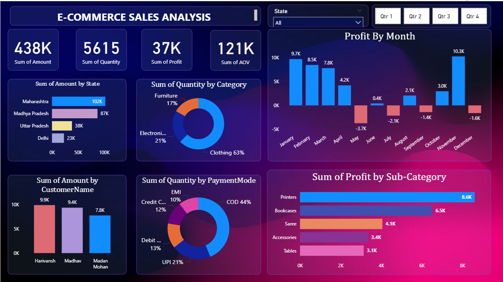

# E-Commerce-Sales-Analysis-using-PowerBI
Interactive Power BI dashboard analyzing e-commerce sales, profit, and customer trends.

## Project Overview
This project analyzes e-commerce sales data using Power BI to track revenue, profit, quantity sold, and customer behavior across states, categories, and time periods.

## Tools & Technologies
- Power BI
- DAX
- Power Query
- Data Modeling
- CSV / Excel Dataset

## Key KPIs
- Total Sales Amount: 438K
- Total Quantity Sold: 5615
- Total Profit: 37K
- Average Order Value (AOV): 121K

## Dashboard Insights
- State-wise sales performance
- Category-wise quantity distribution
- Monthly profit trends (positive & negative months)
- Sub-category profit contribution
- Payment mode analysis (COD, UPI, Cards, EMI)
- Top customers by sales
- Interactive filters for State and Quarter

## Dashboard Preview

## Key Insights
- Clothing contributes the highest quantity sold
- COD is the most used payment mode
- Some months show negative profit, indicating cost or discount impact
- Maharashtra leads in total sales among states

## Conclusion
This dashboard helps stakeholders monitor profitability, customer trends, and sales performance to support data-driven business decisions.

---
Created by **Dhanshree Kawade**
